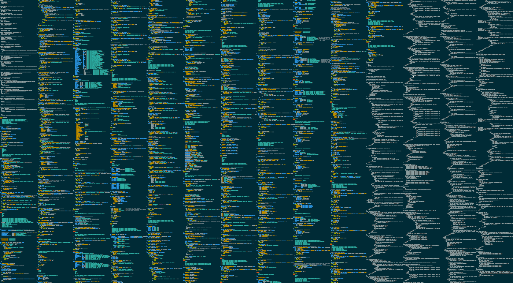

# Capstone Project

## Project Goals

1. To meet and fufil the criteria of the WGU Software Engineering Capstone performance assessment.
1. To demonstrate my skills in designing and implementing complex systems
1. Build a service that fixes a problem my peers and I have

## Code Base

I like to keep track of what the codebase looks like

