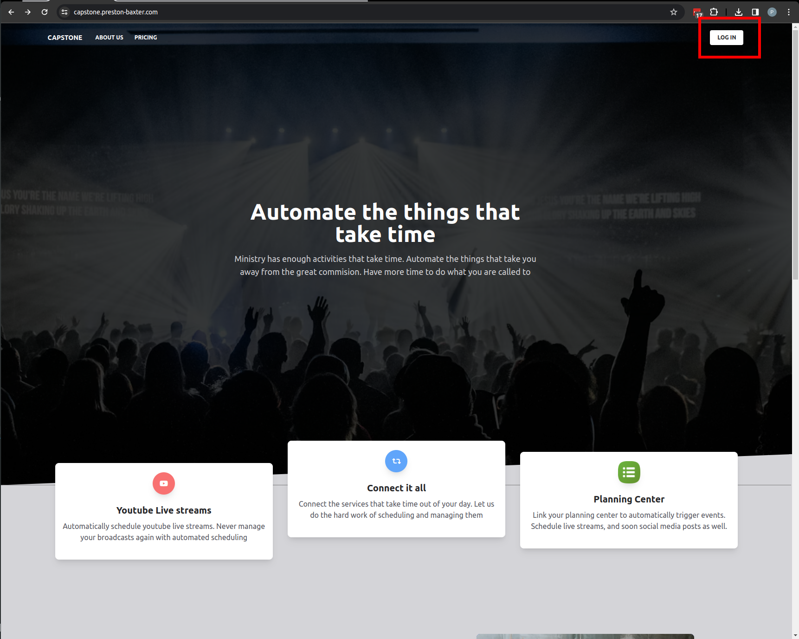
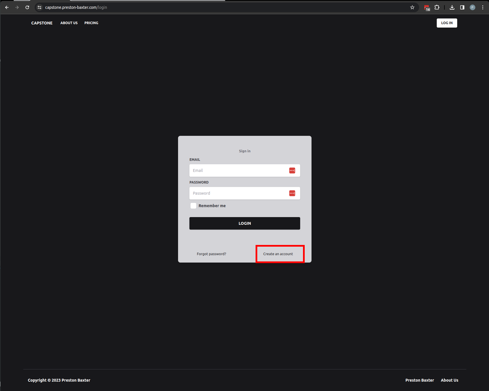
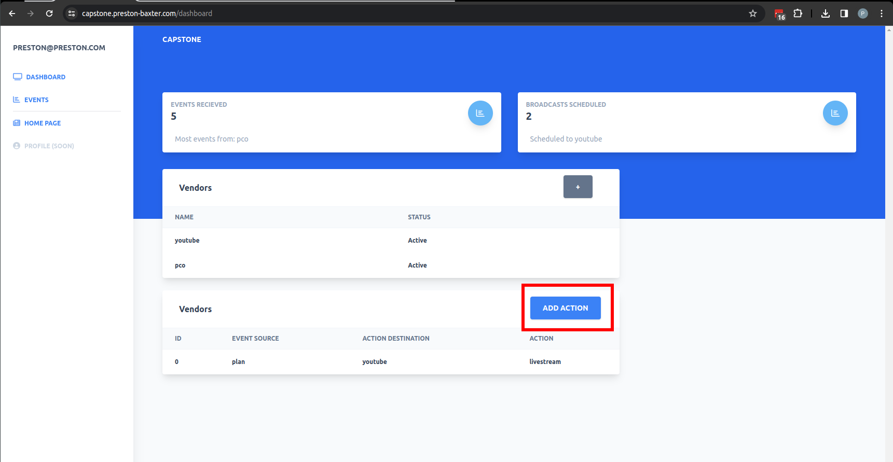
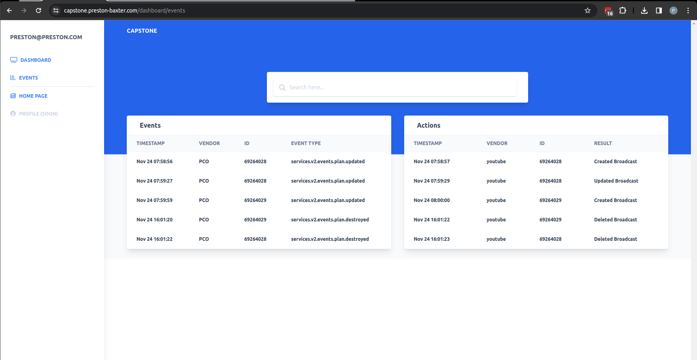

# How to Use

This is your one stop shop for how to use my capstone project

# Logging In

to login click the login button in the top right of the homepage

or navigate to:

[https://capstone.preston-baxter.com/login](https://capstone.preston-baxter.com/login)

# Signing Up
If you don't have an account you can sign up by clicking `create an account`

or at [https://capstone.preston-baxter.com/login](https://capstone.preston-baxter.com/login)

email must be in a valid format

# Adding Vendors

Once logged in on the dashboard page you can select the '+' button and the vendor account you would like to add.

You will then be redirected to that vendors login page to ask permission to act on your behalf.

# Creating Actions

Once you have some vendors configured you can then add an action. Currently the only action supported is scheduling a live stream off of a plan.

In the actions table, select the 'Add Action' button and follow the prompts.

# Auditing

Once you have an action setup you can view how the system is interacting with events and making descision in the events tab

